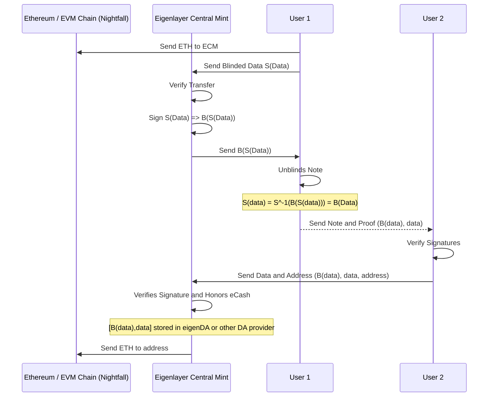

# Cash Me Off-Chain

## A privacy and scaling solution to Ethereum / EVM chains leveraging eigenlayer and chaumian eCash

#### Authors: [Diyahir Campos](https://github.com/diyahir), [James Scanlon](), [Napas Udomsak](https://github.com/tian000/)

---

## Table of Contents

1. [What is eCash?](#what-is-ecash)
2. [Main problem?](#main-problem)
3. [System Architecture](#system-architecture)
4. [Advantages and Use-cases](#advantages-and-use-cases)
5. [Conclusion](#conclusion)
6. [Extended: Chaumian Mints (Blind Signature scheme)](#extended-chaumian-mints-blind-signature-scheme)

---

## What is eCash?

eCash is a digital currency model that functions much like physical cash, but with the added benefits of digital transfer. In this system, the data itself represents the monetary value. Unlike traditional digital transactions that require third-party validations and leave a public record, eCash can be transferred anonymously and without the need for on-chain confirmations. You can send eCash through any data transfer method—be it email, Telegram, SMS, or even written down on paper—and the transaction settles instantly. In a conventional eCash system, a central entity, often likened to a central bank, issues these digital notes and honors them upon presentation. Importantly, this entity doesn't have access to the full transaction history of each note, further preserving user privacy.

- eCash works similar to physical cash, where the data _is_ the money.
- eCash can be transferred in any way you can transfer data with instant settlement.
  - Email, telegram, sms, pen and paper, etc.
- Central bank issues the notes, and honors the notes when they see them, but do not know the full history of the note.

---

## Main problem?

- Central Bank is one entity who requires high levels of trust and can rug the whole system.
- Previous attempts to do this always had a central point of failure.
- With Eigenlayer, there is now a new source of 'Trust' via slashing and incentives.
- So the 'Central Bank', can leverage eigenlayer to operate in a trust-minimized way using their staked ETH as trust-collateral.

---

## System Architecture

### Ethereum (ETH) / EVM Chain (Nightfall)

Ethereum / Nightfall acts as the underlying blockchain where all the smart contracts and transactions are recorded. It's where the initial ETH comes from and returns to as users engage with the Eigenlayer Central Mint. The minter due to the unblinding signature scheme has no idea what the underlying data being signed is, so there is no way to link the note with anyone else in the sytem (anonymity set). Our implementation uses one ERC20 to be transfered, but could be adapted to support multiple ERC20s and native assets.

### Eigenlayer Central Mint (ECM)

Eigenlayer Central Mint (ECM) is the core entity that facilitates the creation and settlement of eCash. It is responsible for:

- Receiving ETH from users.
- Verifying transactions.
- Issuing the blinded and signed data (notes).
- Verifying the validity of the notes when they are presented back for redemption.
- Sending ETH back to the Ethereum blockchain when notes are redeemed.

This entity leverages Eigenlayer's trust-minimized system, operating with staked ETH as trust collateral, thus reducing the risk of centralization.

### User (Minter)

The user is an individual or entity that wants to transact in eCash for reasons such as privacy, scaling, or instant settlement. The user:

- Sends ETH to ECM.
- Sends blinded data (S(Data)) to ECM.
- Receives signed data (B(S(Data))) from ECM.
- Unblinds the note to produce B(Data).
- Sends and receives notes through any data-transfer medium like email, telegram, etc.

### User 2 (Redeemer)

User 2 represents another individual or entity participating in the system, similar to 'User'. User 2 can:

- Receive notes from User or any other users.
- Verify the signatures on the notes.
- Redeem notes by sending them back to ECM along with their Ethereum address.

These participants interact in a sequence to provide a trust-minimized, privacy-preserving eCash system on top of Ethereum and other compatible blockchains.

### Workflow Walkthrough: Send Money

1. **User**: Send ETH
2. **Eigenlayer Central Mint**: Receive Signed 'Data' = S(Data)

### Workflow Walkthrough: Central Bank Signature

1. **User**: Verifies transfer
2. **Eigenlayer Central Mint**: Signs S(data) = B(S(data))

### Workflow Walkthrough: Unblind Note

1. **User**: Unblinds S(data) = S-1(B(S(data))) = B(data)

### Workflow Walkthrough: Transfer Note

- Can be sent via email, telegram, sms, any way of transferring data.

1. **User**: Sends Note and proof: B(data), data
2. **User 2**: Verifies Signatures

### Workflow Walkthrough: Claims Note

1. **User 2**: Sends B(data), data, address to Eigenlayer Central Mint

### Workflow Walkthrough: Mint Settles Note

1. **User 2**: Provides Address
2. **Eigenlayer Central Mint**: Verifies Signature And Honors eCash by Sending ETH

---

## Advantages and Use-cases

The Chaumian mint system moves transactions off the mainnet, which has a couple of straightforward advantages. First, it allows payments to go through existing data transfer methods like email or SMS. This means you can send money using the platforms you're already familiar with, and it happens quickly. Second, because these transactions aren't happening on-chain, the costs are much lower. This makes micropayments—a small but often critical aspect of online transactions—much more practical. The data-as-a-bearer-instrument feature adds an additional layer of utility, essentially letting you 'carry' value in data form across different platforms or even offline.

- Anonymous / Private
- Off-chain
- Offline payments possible
- Minimal on-chain footprint
- Micropayments
- Instant settlement
- New use-cases with data as a bearer instrument

---

## Conclusion

The current bleeding-edge scaling solution to Bitcoin is eCash (Fedimint), but they have a central point of failure/poor trust model with the eCash minter / Central Bank.

Only with Eigenlayer, can you remove this point of failure and have the lowest level of trust to create an eCash system. Any attempt to steal money requires collaboration of all operators, thus will result in early slashing before any loss of funds.

---

## Extended: Chaumian Mints (Blind Signature scheme)

1. **Deposit Money**, user sign data => U(data)
2. **Bank signs** U(Data) => B(U(data)), sends back to user
3. **User unsigns data** => U-1B(U(data)) => B(data)
4. Now user has B(data) signed by Bank without ever revealing what 'data' is to the bank.
5. Bank honors any note with its signature. [B(data), data] is a proof that at some point money was deposited since they signed it at some point.

---
