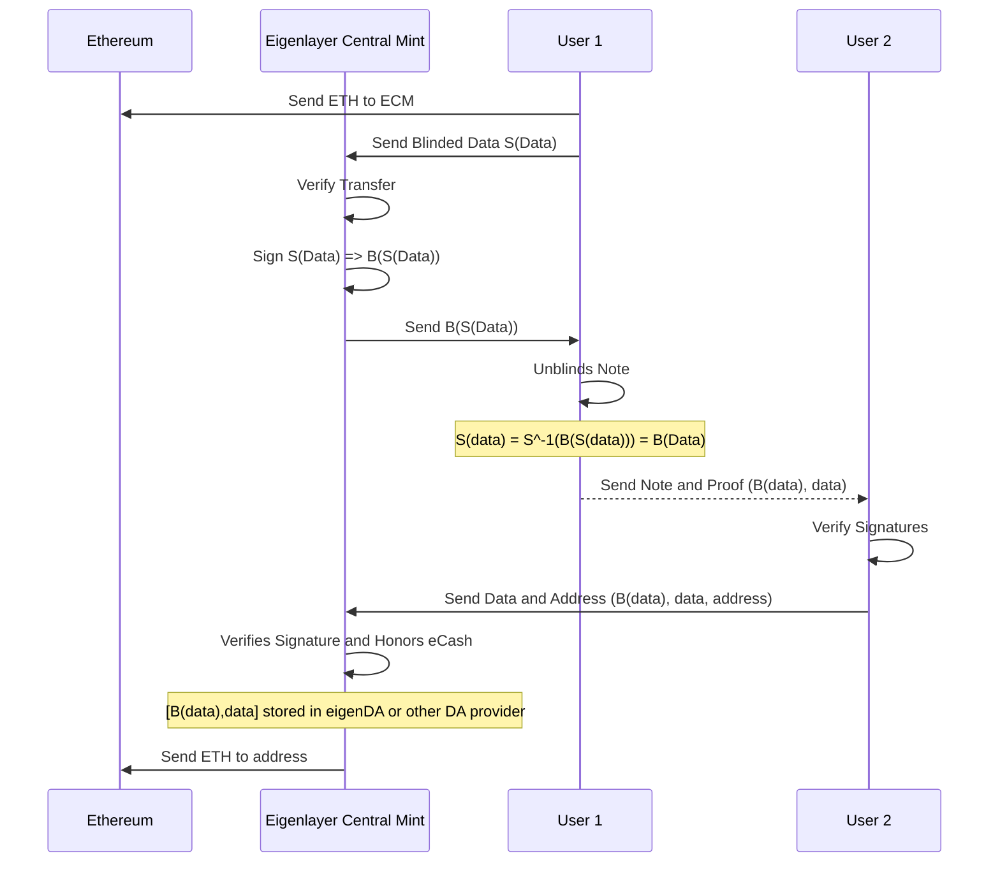

# Cash Me Off-Chain

## A privacy and scaling solution to Ethereum / EVM chains

#### Authors: Diyahir Campos, James Scanlon, Napas Udomsak

---

## Project structure

1. [Smart Contracts](/contracts/)
2. [eCash Web Wallet](/src/)
3. [EY Challenge Markdown](/EYChallenge.md)

## System Architecture



## Getting Started: Web Wallet

First, run the development server:

```bash
npm run dev
# or
yarn dev
# or
pnpm dev
```

Open [http://localhost:3000](http://localhost:3000) with your browser to see the result.

## Getting Started: Smart Contracts

Foundry required to be installed.

```bash
cd contracts
forge install openzeppelin/openzeppelin-contracts --no-git
forge install foundry-rs/forge-std --no-git
forge test
```
